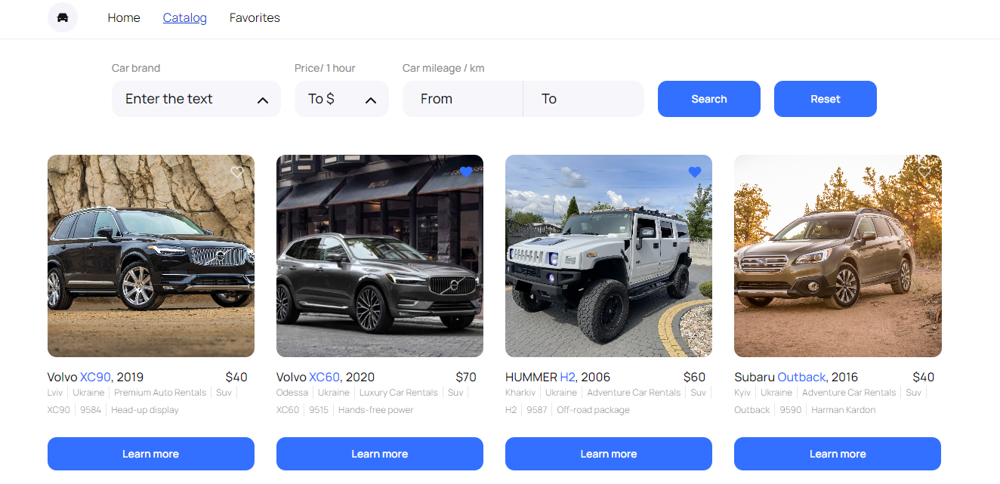

# Rental cat  
Додаток надає можливість швидко та зручно обрати машину для оренди.

## Опис
Додаток складається з трьох сторінок

### Home
Головна сторінка з загальним описом послуг, що надає компанія.

### Catalog
1. Містить каталог автівок різної комплектації, які користувач може фільтрувати за маркою, ціною та пробігом
2. Кнопка load more для отримання додаткових оголошень. У випадку, коли отримано всі існуючі оголошення - кнопка не відображається.

### Favotites
1. Містить оголошення, які були додані користувачем в улюблені. Оголошення зберігаються в localstorage. Тобто якщо додати оголошення в улюблені та оновити сторінку - то кнопка все одно залишається в стані “улюбленого оголошення” із відповідним кольором.
2. По кліку на кнопку learn more відкриватись модальне вікно з детальною інформацією про авто та умови його оренди.

## Матеріали і бібліотека
Цей додаток :
- зібраний за допомогою [Vite](https://vite-docs-ru.vercel.app/)
- включає використання backend [mockapi.io](mockapi.io)
- стилізований з [styled-components](https://www.npmjs.com/package/styled-components)

Тут знаходиться: [макет](https://www.figma.com/file/XhC8FSCfAkraEF5l7Hx4fL/Test?type=design&node-id=0-1&mode=design&t=Ed3b0heFOmE2LSXU-0) та [технічне завдання](https://docs.google.com/document/d/1v-UGyo4NXQTV0QaKh2Bw__v50qfCUHYw1GGJ2qUv7dU/edit?usp=sharing)

## Запустити додаток у режимі розробки
В каталозі проєкту запустити `npm run dev` та відкрийте запропонований localhost
